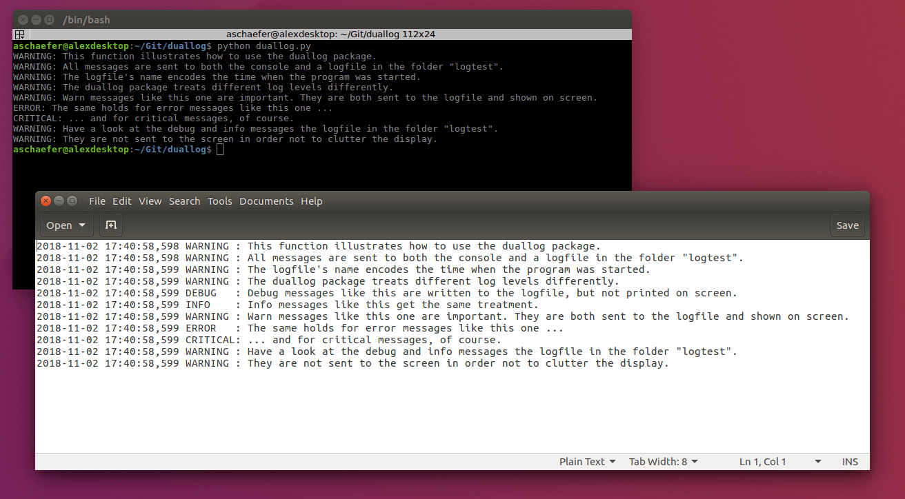

# The duallog package

Python package to enable simultaneous logging to console and logfile.


[Duallog screenshot](https://github.com/acschaefer/duallog/blob/master/duallog_screenshot.png)

## How to install duallog?

You can install duallog using [pip](https://www.w3schools.com/python/python_pip.asp), or you can install from source.
Below you find instructions for both ways.

### Installation via pip

In the terminal, run `pip install duallog`.

### Installation from source

1. Download and unpack this repository.
2. Open a terminal and navigate to the repository. 
3. Execute `python setup.py install` from within the repository.

## How to use duallog?

Using duallog is very simple, as illustrated in the following minimal example script.

```python
# Import the duallog package to set up simultaneous logging to screen and console.
import duallog

# Import the logging package to generate log messages.
import logging

# Set up dual logging and tell duallog where to store the logfiles.
duallog.setup('logtest')

# Generate some log messages.
logging.debug('Debug messages are only sent to the logfile.')
logging.info('Info messages are not shown on the console, too.')
logging.warning('Warnings appear both on the console and in the logfile.')
logging.error('Errors get the same treatment.')
logging.critical('And critical messages, of course.')
```

The output of this program is shown in the screenshot at the top of this page.